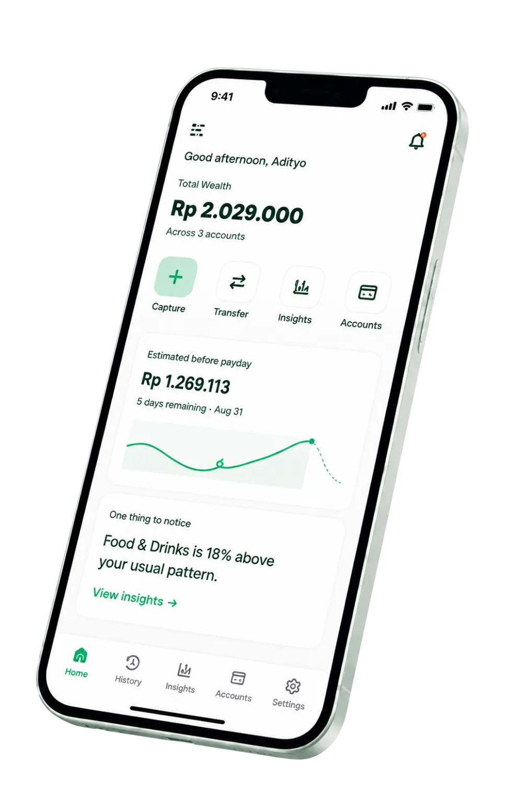

# SALDO - Smart Money & Personal Finance Tracker

> Aplikasi pencatatan keuangan pribadi cerdas berbasis bahasa alami (teks dan suara), sinkronisasi multi-akun, serta analitik arus kas prediktif menjelang tanggal gajian.

[Live Demo](https://usesaldo.vercel.app) · [Frontend Source Code](./frontend) · [Backend Architecture & Docs](./backend)

<br />

<p align="center">
  
</p>

---

## Tentang SALDO

Sebagian besar aplikasi pencatat keuangan ditinggalkan bukan karena fiturnya kurang lengkap, melainkan karena proses pencatatan yang melelahkan: pengguna harus memilih dompet, membuka dropdown kategori, menentukan tanggal, lalu mengisi nominal secara manual setiap kali melakukan transaksi.

**SALDO** diciptakan untuk mengeliminasi friksi tersebut. Cukup ketik atau ucapkan apa yang baru saja dibeli dalam bahasa santai sehari-hari (contoh: *"tadi beli kopi 25rb pake gopay"* atau *"kemarin bayar token listrik 150rb via bca"*), sistem akan mengenali nominal, akun sumber, kategori, serta tanggalnya secara otomatis.

---

## Fitur Unggulan

### 1. Natural Language Financial Capture (Teks & Suara)
Ketik atau rekam suara transaksi dalam bahasa santai sehari-hari. Sistem terintegrasi dengan mesin parsing cerdas yang mengenali format angka khas Indonesia (*25k*, *50rb*, *2.5jt*), istilah transaksi (*beli, bayar, checkout, terima transfer*), serta tanggal relatif (*kemarin, tadi, 3 hari lalu*). Dilengkapi *Intent Guard* berlapis untuk memfilter obrolan non-finansial dan mencegah eksploitasi prompt.

### 2. Multi-Akun & Rekonsiliasi Saldo Otomatis
Kelola berbagai dompet secara bersamaan (Tunai, Bank BCA, GoPay, OVO, ShopeePay, dan dompet kustom lainnya). Transaksi pengeluaran, pemasukan, maupun transfer antar-rekening pribadi langsung memperbarui saldo masing-masing dompet secara real-time dan terpetakan ke kategori yang sesuai.

### 3. Analisis Arus Kas & Prediksi Saldo Menjelang Gajian
Bukan sekadar daftar riwayat angka mentah. SALDO menghitung laju pengeluaran harian (*spending velocity*), rasio tabungan bulanan, perbandingan tren dari periode sebelumnya, serta memproyeksikan estimasi sisa dana sebelum tanggal gajian berikutnya berdasarkan kebiasaan belanja nyata.

---

## Alur Pemrosesan Data

```text
Ketik / Ucapkan Kalimat Transaksi
         ↓
Pengecekan Keamanan & Intent Guard (Penyaringan input non-finansial)
         ↓
Ekstraksi Data Terstruktur via AI Engine (Nominal, Akun, Kategori, Tanggal)
         ↓
Pembaruan Saldo Akun & Rekonsiliasi Buku Kas Otomatis
         ↓
Wawasan Finansial & Proyeksi Saldo Diperbarui Real-Time
```

---

## Tech Stack

- **Frontend**: React 19, Vite, Tailwind CSS v4, Lucide React, React Router v7
- **Backend Architecture**: Node.js, Express 5, Vercel Serverless Functions
- **Database**: MongoDB Atlas dengan Mongoose 9
- **AI & Parsing Engine**: OpenRouter API (GPT-4o-mini) dengan skema keluaran terstruktur
- **Keamanan & Autentikasi**: Stateless JWT, Bcryptjs Password Hashing, Verifikasi OTP via Email (Nodemailer)
- **Produksi & Deployment**: Vercel Platform ([usesaldo.vercel.app](https://usesaldo.vercel.app))

---

## Tampilan Antarmuka

<p align="center">
  
</p>

---

## Catatan Repositori Public Showcase

Repositori ini difungsikan sebagai **Public Technical Showcase** untuk keperluan portfolio profesional.
- **Frontend**: Seluruh kode sumber antarmuka, komponen UI, state management, interaksi suara, dan visualisasi data tersedia secara terbuka pada folder [`frontend/`](./frontend).
- **Backend**: Untuk menjaga keamanan data pengguna produksi dan perlindungan hak kekayaan intelektual pengembang, kode implementasi logika bisnis backend dan prompt AI khusus dirahasiakan. Dokumentasi komprehensif mengenai arsitektur, alur data, dan rancangan sistem backend dapat dibaca pada [`backend/README.md`](./backend/README.md).

---

## Menjalankan Frontend Secara Lokal

Bagi yang ingin meninjau atau menjalankan antarmuka aplikasi di lingkungan lokal:

1. Clone repositori ini:
   ```bash
   git clone https://github.com/adityafajarsy/SALDO_Smart-Tracking-Money.git
   cd SALDO_Smart-Tracking-Money
   ```

2. Masuk ke direktori frontend dan pasang dependensi:
   ```bash
   cd frontend
   npm install
   ```

3. Jalankan server pengembangan Vite:
   ```bash
   npm run dev
   ```

4. Buka peramban di `http://localhost:5173`.
